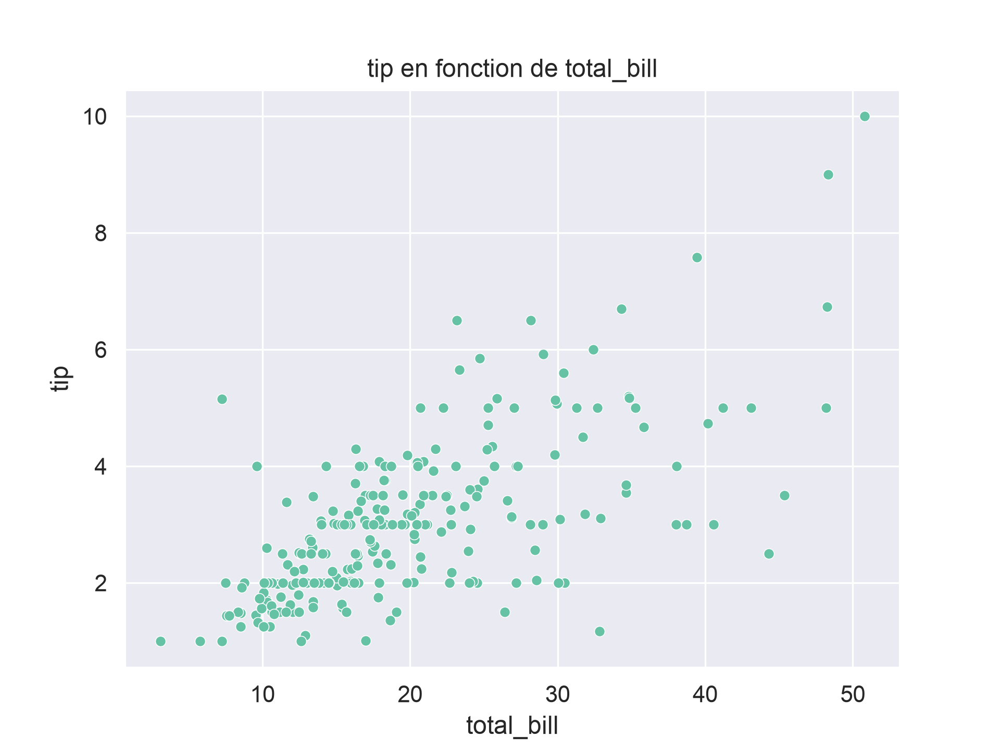
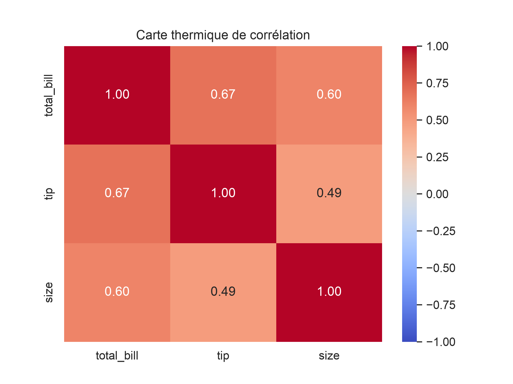

# DataViz Tips

## Description

Projet d'apprentissage inspiré du projet [Data Visualization Basics](https://roadmap.sh/projects/data-visualization-tutorial) de roadmap.sh. Il compare **Matplotlib** et **Seaborn** sur le jeu de données `tips` (pourboires dans un restaurant).

Chaque graphique est tracé avec les deux bibliothèques, avec les mêmes données, la même échelle et le même style.

Le code réutilisable vit dans `src/dataviz_tips`, il est testé, et les
notebooks l'appellent sans y dupliquer de logique.

## Prérequis

- Python 3.11 ou supérieur
- [uv](https://docs.astral.sh/uv/)
- Le téléchargement du jeu de données se fait via `seaborn.load_dataset`

## Installation

```bash
git clone https://github.com/chris-nd/dataviz-tips.git
cd dataviz-tips
uv sync
```

`uv sync` crée l'environnement et installe le projet et ses dépendances
définies dans `pyproject.toml`.

## Fonctionnalités

Dans `src/dataviz_tips`:

- `data`: chargement du jeu de données avec suppression des lignes dupliquées
  (`load_tips`, `drop_duplicate_rows`);

- `stats`: bornes de détection des valeurs extrêmes par la règle de
  l'écart interquartile (`iqr_bounds`), séparation des lignes extrêmes
  (`split_extremes`), matrice de corrélation (`correlation_matrix`);

- `plots`: histogrammes, comptages de groupes, boîtes à moustaches, nuages de
  points et cartes thermiques de corrélation, en versions `_mpl` (Matplotlib)
  et `_sns` (Seaborn);

- `plots.save_figure`: export d'une figure vers un format géré par
  Matplotlib (PNG, PDF, SVG...). Les dossiers manquants sont créés, un fichier
  existant est remplacé, une extension absente ou inconnue lève une
  `ValueError`.

## Démarrage rapide

Les fonctions de tracé reçoivent les données et retournent un `Axes`
Matplotlib. Les arguments `ax` et `bins` doivent être nommés.

```python
import matplotlib.pyplot as plt

from dataviz_tips.data import load_tips
from dataviz_tips.plots import plot_histogram_mpl

tips = load_tips()

fig, ax = plt.subplots()
plot_histogram_mpl(tips, "total_bill", bins=20, ax=ax)
plt.show()
```

Matrice de corrélation et carte thermique :

```python
from dataviz_tips.plots import plot_correlation_heatmap_sns
from dataviz_tips.stats import correlation_matrix

corr = correlation_matrix(tips)
plot_correlation_heatmap_sns(corr)
plt.show()
```

Enregistrer une figure (les chemins relatifs partent du dossier de travail notebooks/):

```python
from pathlib import Path

from dataviz_tips.plots import save_figure

save_figure(fig, Path("../reports/figures") / "histogram_total_bill_mpl.png")
```

### Choisir le dossier d'export

Le notebook 04_export_insights.ipynb lit la variable d'environnement PATH_FIGURE (par défaut ../reports/figures, relatif au dossier notebooks/).

Pour changer ce chemin, copiez le modèle, puis éditez .env (la ligne attendue est PATH_FIGURE=...) :

```bash
cp .env.example .env     
```

## Résultats





## Tests et qualité du code

```bash
uv run pytest --cov -v
uv run ruff check
uv run ruff format --check
```

Les tests n'ont besoin d'aucune connexion : le téléchargement du jeu de données y est simulé.

## Structure du projet

```bash
src/dataviz_tips/   data.py, stats.py, plots.py
tests/              tests unitaires
notebooks/          exploration, analyse, visualisation, export
reports/            rapports et figures exportées
```

## Documentation

### Décisions prises

- **Doublon**: une ligne identique est supprimée (244 → 243). Le jeu n'a
  aucun identifiant de transaction: c'est probablement une double saisie,
  mais cela ne peut pas être prouvé. L'index est réinitialisé.

- **Valeurs extrêmes conservées**: 9 factures et 8 pourboires sortent de
  `[Q1 - 1,5 x IQR ; Q3 + 1,5 x IQR]`. Une valeur rare n'est pas une valeur
  erronée. Une valeur exactement sur une borne n'est pas extrême. Les
  corrélations varient de moins de 0,1 avec ou sans ces lignes (critère fixé
  avant le calcul).

- **Valeurs manquantes**: aucune dans le jeu d'origine ; les fonctions les
  ignorent de la même façon pour Matplotlib et Seaborn.

- **Lecture des corrélations**: convention adaptée de Cohen (seuils à 0,1,
  0,3 et 0,5 en valeur absolue).

- **Comparaison équitable** : même nombre de classes (`bins`) pour les
  histogrammes, même échelle `[-1, 1]` pour les cartes thermiques, même style
  appliqué aux deux bibliothèques.

- **Unité**: la source ne précise pas la devise, les montants n'ont donc pas
  de symbole monétaire.

### Notebooks et rapports

1. `notebooks/01_exploration.ipynb`: structure, types, valeurs manquantes et
   doublons;

2. `notebooks/02_analyze.ipynb`: statistiques descriptives, seuils IQR et
   corrélations;

3. `notebooks/03_visualization_matplotlib.ipynb` et
`notebooks/03_visualization_seaborn.ipynb`: visualisations avec les deux
   bibliothèques;

4. `notebooks/04_export_insights.ipynb` : export des 14 figures vers
   `reports/figures/`.

Les documents de synthèse sont dans `reports/` :

- [`data_dictionaries.md`](reports/data_dictionaries.md) : dictionnaire de
  données;
- [`exploratory_data_analysis_report.md`](reports/exploratory_data_analysis_report.md) :
  rapport d'analyse exploratoire.
